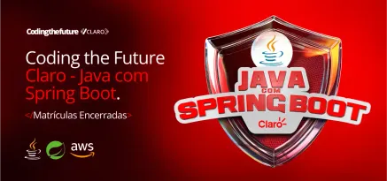

# DESAFIO DIO - SPRING BOOT
## Criação de uma Rest API

Esse projeto foi inicialmente criado para o bootcamp "Claro - Java com Spring Boot" da DIO (Digital Innovation One).



## Tecnologias

Algumas tecnologias usadas:
- Spring Boot
- React com Typescript
- Documentação da API com Swagger
- Uso do H2 Database, um banco em memória
- Lombok

## Rodando o projeto

Para iniciar o frontend, use:

```
cd frontend
npm install
npm run dev
```

## Frontend React

Para criar o frontend, foi usado o comando:

```
npm create vite@latest frontend -- --template react-ts
```
